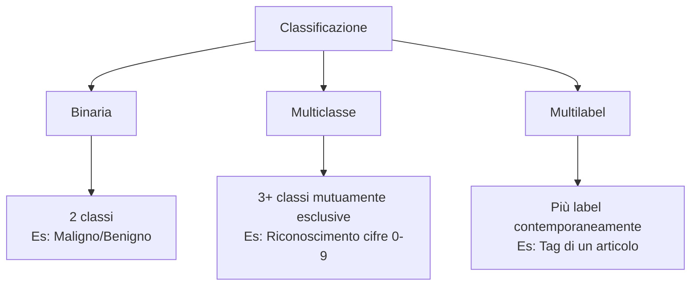
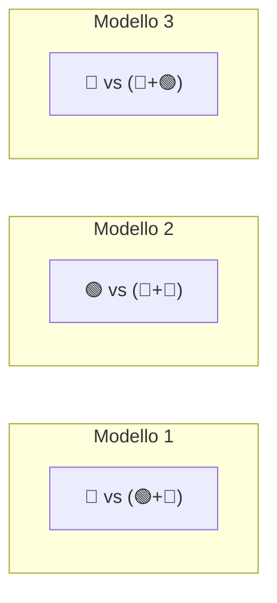
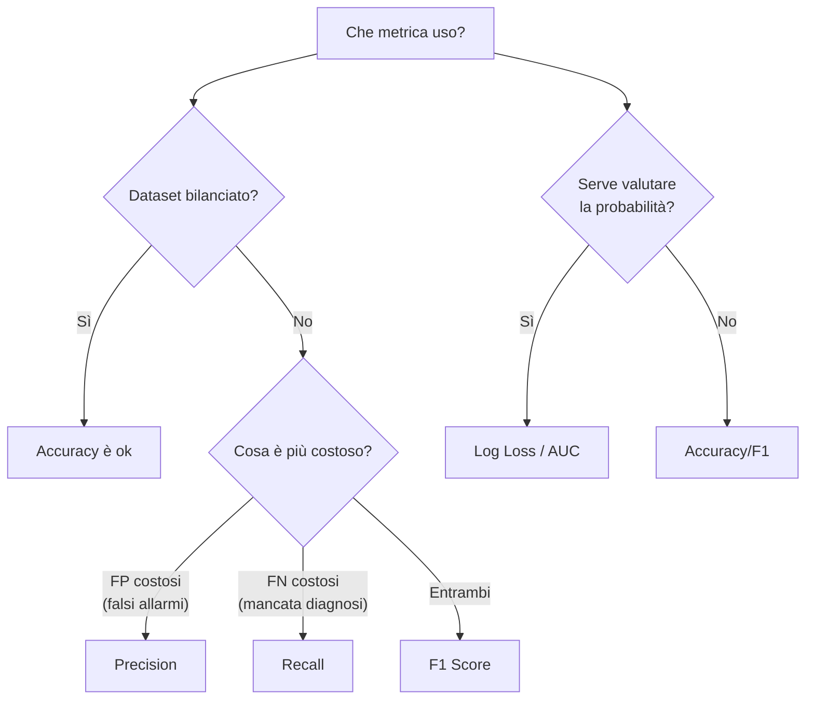

# 📘 La Classificazione — Guida Completa di Studio

> **Corso**: Fondamenti di Machine Learning — ProfessionAI  
> **Docente**: Giuseppe Gullo  
> **Argomento**: La Classificazione (Binaria, Multiclasse, Metriche)

---

## Indice

1. [Cos'è la Classificazione](#1-cosè-la-classificazione)
2. [La Regressione Logistica](#2-la-regressione-logistica)
   - [Dal problema al modello matematico](#21-dal-problema-al-modello-matematico)
   - [Il Decision Boundary](#22-il-decision-boundary)
   - [La funzione di attivazione](#23-la-funzione-di-attivazione)
   - [La funzione Sigmoide](#24-la-funzione-sigmoide-logistica)
   - [La funzione di costo (Log Loss)](#25-la-funzione-di-costo)
3. [La Classificazione Multiclasse](#3-la-classificazione-multiclasse)
   - [One vs Rest (OvR)](#31-metodo-one-vs-rest-ovr)
   - [One vs One (OvO)](#32-metodo-one-vs-one-ovo)
   - [Classi vs Label (Multilabel)](#33-classi-vs-label-multilabel)
4. [Metriche per la Classificazione](#4-metriche-per-la-classificazione)
   - [Matrice di Confusione](#41-matrice-di-confusione)
   - [Accuracy](#42-accuracy)
   - [Precision](#43-precision)
   - [Recall / Sensitivity](#44-recall-sensitivity)
   - [Specificity](#45-specificity)
   - [ROC Curve e AUC](#46-curva-roc-e-auc)
   - [F1 Score](#47-f1-score)
   - [Log Loss](#48-log-loss-cross-entropy)
5. [Riepilogo Formule](#5-riepilogo-formule)

---

## 1. Cos'è la Classificazione

La **classificazione** è un task dell'**apprendimento supervisionato** in cui l'obiettivo è prevedere una **classe** (variabile categorica), non un valore numerico continuo (come nella regressione).

### Differenza chiave: Regressione vs Classificazione

| Aspetto | Regressione | Classificazione |
|---|---|---|
| **Output** | Valore numerico continuo | Classe / Categoria |
| **Esempio** | Prevedere il prezzo di una casa | Diagnosticare un tumore come benigno/maligno |
| **Funzione** | Regressione lineare | Regressione logistica |

### Tipologie di Classificazione



---

## 2. La Regressione Logistica

### 2.1 Dal problema al modello matematico

Prendiamo un esempio concreto dal corso: **classificare un tumore come maligno o benigno** usando due feature: *raggio medio* e *punti di concavità*.

#### Step 1 — I dati grezzi

| Raggio medio | Punti di concavità | Diagnosi |
|---|---|---|
| 17.99 | 0.14710 | maligno |
| 13.54 | 0.04781 | benigno |
| 20.57 | 0.07017 | maligno |
| 9.504 | 0.02076 | benigno |

#### Step 2 — Standardizzazione (scaling)

Normalizziamo le feature con media 0 e deviazione standard 1 (StandardScaler):

$$\Large z_i = \frac{x_i - \mu}{\sigma}$$

dove:
- $z_i$ = valore standardizzato della feature per l'osservazione *i*
- $x_i$ = valore originale della feature
- $\mu$ = **media** di tutti i valori della feature nel dataset
- $\sigma$ = **deviazione standard** di tutti i valori della feature nel dataset

| Raggio medio (scaled) | Punti di concavità (scaled) | Diagnosi |
|---|---|---|
| 1.097 | 2.532 | maligno |
| −0.167 | −0.029 | benigno |
| 1.830 | 0.548 | maligno |
| −1.313 | −0.726 | benigno |

#### Step 3 — Codifica della variabile target

Trasformiamo la variabile categorica in numerica:

- **Maligno** = Classe Positiva = **1**
- **Benigno** = Classe Negativa = **0**

> [!IMPORTANT]
> La scelta di quale classe sia "positiva" (1) e quale "negativa" (0) è convenzionale, ma ha impatto diretto su come interpretiamo tutte le metriche successive (precision, recall, ecc.).

---

### 2.2 Il Decision Boundary

Il **Decision Boundary** (soglia di decisione) è la **retta** (o iperpiano, in più dimensioni) che separa quanto meglio le due classi nello spazio delle feature.

#### Il modello lineare sottostante

La regressione logistica parte dalla stessa equazione lineare della regressione:

$$\Large z = w_1 x_1 + w_2 x_2 + b$$

dove:
- `x₁, x₂` sono le feature (es. raggio medio, punti di concavità)
- `w₁, w₂` sono i **pesi** (weights) — il modello li apprende durante l'addestramento
- `b` è il **bias** (intercetta)

Il valore di `z` determina da che parte del boundary cade un'osservazione:

| Valore di z | Interpretazione |
|---|---|
| **z > 0** | Il punto sta dal lato della **classe positiva** (maligno) |
| **z < 0** | Il punto sta dal lato della **classe negativa** (benigno) |
| **z = 0** | Il punto sta esattamente **sul boundary** |

#### Esempio numerico

Supponiamo che dopo l'addestramento il modello abbia imparato:
- w₁ = 0.8 (peso per raggio medio)
- w₂ = 1.2 (peso per punti di concavità)
- b = −0.5

Per un tumore con raggio medio (scaled) = 1.097 e punti di concavità (scaled) = 2.532:

$$\Large z = 0.8 \times 1.097 + 1.2 \times 2.532 + (-0.5) = 0.878 + 3.038 - 0.5 = 3.416$$

Dato che **z = 3.416 > 0** → il modello classifica come **maligno** ✓

Per un tumore con raggio (scaled) = −1.313 e concavità (scaled) = −0.726:

$$\Large z = 0.8 \times (-1.313) + 1.2 \times (-0.726) + (-0.5) = -1.050 - 0.871 - 0.5 = -2.421$$

Dato che **z = −2.421 < 0** → il modello classifica come **benigno** ✓

---

### 2.3 La Funzione di Attivazione

Nella classificazione, non ci basta il valore grezzo `z`. Vogliamo un **output discreto** (0 o 1) o una **probabilità** (tra 0 e 1). Per questo si usa una **funzione di attivazione** che trasforma `z` nell'output finale.

#### Binary Step (la più semplice)

La funzione a gradino converte direttamente `z` in 0 o 1:

$$\Large \text{BinaryStep}(z) = \begin{cases} 1 & \text{se } z \geq 0 \\ 0 & \text{se } z < 0 \end{cases}$$

**Problema**: non fornisce una probabilità, solo una decisione secca. Non è derivabile in z = 0, quindi non possiamo usare il gradiente per ottimizzare i pesi.

---

### 2.4 La Funzione Sigmoide (Logistica)

Qui entra in gioco la vera protagonista della regressione logistica: la **funzione sigmoide** (detta anche funzione logistica).

$$\Large \sigma(z) = \frac{1}{1 + e^{-z}}$$

dove:
- $\sigma(z)$ = output della funzione sigmoide (probabilità prevista, tra 0 e 1)
- $z$ = valore di input (output del modello lineare: $w_1 x_1 + w_2 x_2 + b$)
- $e$ = costante di Eulero (≈ 2.718)

#### Proprietà fondamentali

| Proprietà | Descrizione |
|---|---|
| **Range** | Output sempre tra 0 e 1 → interpretabile come probabilità |
| **σ(0) = 0.5** | Quando z = 0, la probabilità è esattamente 50% |
| **z → +∞ ⇒ σ(z) → 1** | Valori grandi di z danno probabilità vicine a 1 |
| **z → −∞ ⇒ σ(z) → 0** | Valori molto negativi danno probabilità vicine a 0 |
| **Derivabile ovunque** | Permette l'uso della discesa del gradiente |
| **Simmetria** | σ(−z) = 1 − σ(z) |

#### Calcolo passo-passo

Riprendiamo l'esempio precedente con z = 3.416:

$$\Large \sigma(3.416) = \frac{1}{1 + e^{-3.416}} = \frac{1}{1 + 0.0327} = \frac{1}{1.0327} = 0.968$$

**Interpretazione**: il modello prevede una probabilità del **96.8%** che il tumore sia maligno.

Ora con z = −2.421:

$$\Large \sigma(-2.421) = \frac{1}{1 + e^{2.421}} = \frac{1}{1 + 11.257} = \frac{1}{12.257} = 0.082$$

**Interpretazione**: probabilità dell'**8.2%** che sia maligno → quindi probabilità del **91.8%** che sia benigno.

#### La soglia (threshold)

Di default il threshold è **0.5**:

$$\Large \hat{y} = \begin{cases} 1 \text{ (positivo)} & \text{se } \sigma(z) \geq 0.5 \\ 0 \text{ (negativo)} & \text{se } \sigma(z) < 0.5 \end{cases}$$

dove:
- $\hat{y}$ = classe prevista dal modello (0 o 1)
- $\sigma(z)$ = probabilità stimata dalla funzione sigmoide
- $0.5$ = soglia (threshold) di default

> [!TIP]
> Il threshold può essere modificato in base al contesto. In campo medico, potremmo abbassarlo a 0.3 per essere più conservativi: meglio un falso allarme che un tumore non diagnosticato.

---

### 2.5 La Funzione di Costo

Come si addestra un modello di regressione logistica? **Minimizzando una funzione di costo** tramite un algoritmo di ottimizzazione iterativo (tipicamente la **discesa del gradiente**).

#### Step 1 — Likelihood (Verosimiglianza)

La domanda fondamentale è: *qual è la probabilità di ottenere il target Y, avendo le feature X e i parametri W?*

Per una singola osservazione, la likelihood è:

$$\Large P(y_i | x_i, W) = \hat{y}_i^{y_i} \cdot (1 - \hat{y}_i)^{(1 - y_i)}$$

dove:
- `ŷᵢ = σ(z)` è la probabilità prevista dal modello
- `yᵢ` è il valore reale (0 o 1)

**Perché funziona?** Vediamo i due casi:

| Caso | y = 1 (positivo) | y = 0 (negativo) |
|---|---|---|
| **Formula diventa** | ŷ¹ · (1−ŷ)⁰ = **ŷ** | ŷ⁰ · (1−ŷ)¹ = **1−ŷ** |
| **Interpretazione** | Vogliamo ŷ vicino a 1 | Vogliamo ŷ vicino a 0 (cioè 1−ŷ vicino a 1) |

Per tutto il dataset (assumendo osservazioni indipendenti):

$$\Large L(W) = \prod_{i=1}^{n} P(y_i | x_i, W)$$

dove:
- $L(W)$ = likelihood (verosimiglianza) complessiva del modello
- $\prod$ = produttoria (prodotto di tutti i termini)
- $n$ = numero totale di osservazioni nel dataset
- $P(y_i | x_i, W)$ = probabilità dell'osservazione *i* dato il modello

#### Step 2 — Log Likelihood

Il prodotto di tanti numeri piccoli causa problemi numerici (underflow). Soluzione: usiamo il **logaritmo** — che trasforma il prodotto in somma.

$$\Large \log L(W) = \sum_{i=1}^{n} \left[ y_i \cdot \log(\hat{y}_i) + (1 - y_i) \cdot \log(1 - \hat{y}_i) \right]$$

dove:
- $\log L(W)$ = logaritmo della likelihood
- $\sum$ = sommatoria su tutte le *n* osservazioni
- $y_i$ = valore reale della classe (0 o 1) per l'osservazione *i*
- $\hat{y}_i$ = probabilità prevista dal modello per l'osservazione *i*
- $\log$ = logaritmo naturale

> [!NOTE]
> Il logaritmo è una funzione **monotona crescente**: massimizzare L(W) equivale a massimizzare log L(W). Ma il logaritmo rende i calcoli molto più semplici.

#### Step 3 — Log Loss (Cross Entropy)

Nella pratica, preferiamo **minimizzare** una funzione di costo anziché massimizzare la verosimiglianza. Basta cambiare il segno:

$$\Large \text{LogLoss} = -\frac{1}{n} \sum_{i=1}^{n} \left[ y_i \cdot \log(\hat{y}_i) + (1 - y_i) \cdot \log(1 - \hat{y}_i) \right]$$

dove:
- $n$ = numero totale di osservazioni
- $y_i$ = classe reale (0 o 1)
- $\hat{y}_i$ = probabilità prevista dal modello
- il segno $-$ trasforma la massimizzazione della likelihood in minimizzazione del costo
- $\frac{1}{n}$ = media su tutte le osservazioni

#### Esempio numerico completo

Supponiamo 3 osservazioni:

| Osservaz. | y (reale) | ŷ (previsto) | Termine |
|---|---|---|---|
| 1 | 1 | 0.968 | 1·log(0.968) + 0·log(0.032) = **−0.033** |
| 2 | 0 | 0.082 | 0·log(0.082) + 1·log(0.918) = **−0.086** |
| 3 | 1 | 0.750 | 1·log(0.750) + 0·log(0.250) = **−0.288** |

$$\Large \text{LogLoss} = -\frac{1}{3}(-0.033 - 0.086 - 0.288) = -\frac{-0.407}{3} = 0.136$$

**Interpretazione**: più la Log Loss è vicina a 0, migliore è il modello.

---

## 3. La Classificazione Multiclasse

Quando le classi da prevedere sono **più di due**, abbiamo un problema di classificazione multiclasse.

> Esempio: riconoscere cifre scritte a mano → 10 classi (0, 1, 2, …, 9)

### 3.1 Metodo One vs Rest (OvR)

*Detto anche One vs All (OvA).*

L'idea è semplice: **scomporre un problema multiclasse in più problemi binari**.

#### Come funziona, passo per passo

Supponiamo di avere 3 classi: 🔴, 🟢, 🔵



**Procedimento:**

1. **Per ogni classe**, addestra un modello di regressione logistica binaria
2. In ogni modello, la classe scelta è quella **positiva**, tutte le altre diventano **negative**
3. Per classificare una nuova osservazione, **esegui tutti i modelli**
4. Assegna la classe del modello che restituisce la **probabilità più alta**

#### Esempio numerico

Per una nuova osservazione x, i tre modelli restituiscono:

| Modello | Classe positiva | Probabilità stimata |
|---|---|---|
| Modello 1 | 🔴 | 0.72 |
| Modello 2 | 🟢 | 0.15 |
| Modello 3 | 🔵 | 0.58 |

**Classificazione finale**: 🔴 (probabilità più alta = 0.72)

#### Numero di modelli

$$\Large \text{Modelli OvR} = K$$

dove K è il numero di classi. Con 10 classi → **10 modelli**.

---

### 3.2 Metodo One vs One (OvO)

Addestra un modello per ogni **coppia** di classi.

#### Come funziona

Sempre con 3 classi: 🔴, 🟢, 🔵

| Modello | Confronto |
|---|---|
| Modello 1 | 🔴 vs 🟢 |
| Modello 2 | 🔴 vs 🔵 |
| Modello 3 | 🟢 vs 🔵 |

Ogni modello "vota" per una classe. La classe con più voti vince.

#### Numero di modelli

$$\Large \text{Modelli OvO} = \frac{K \times (K - 1)}{2}$$

dove:
- $K$ = numero totale di classi nel problema
- $K - 1$ = le altre classi con cui confrontare ciascuna classe
- si divide per $2$ perché ogni coppia (A vs B) è uguale a (B vs A)

| K (classi) | Modelli OvR | Modelli OvO |
|---|---|---|
| 3 | 3 | 3 |
| 5 | 5 | 10 |
| 10 | 10 | 45 |
| 26 | 26 | 325 |

> [!WARNING]
> All'aumentare del numero di classi, il numero di modelli nel OvO **cresce molto più velocemente** rispetto all'OvR. Per molte classi, OvR è generalmente preferibile.

---

### 3.3 Classi vs Label (Multilabel)

| Concetto | Definizione | Esempio |
|---|---|---|
| **Classe** | Un'osservazione può appartenere a **una sola classe** (mutuamente esclusiva) | Paese di nascita: se sei nato in Italia, non sei nato negli USA |
| **Label** | Un'osservazione può avere **più label** contemporaneamente | Cittadinanza: puoi avere sia quella italiana che quella statunitense |

Quando la variabile target è un insieme di label, si parla di **classificazione multilabel**.

```
Classificazione Multiclasse:   y ∈ {A, B, C}         → una sola classe
Classificazione Multilabel:    y ⊆ {tag1, tag2, tag3} → una o più label
```

---

## 4. Metriche per la Classificazione

Le metriche ci permettono di **quantificare la bontà** di un modello di classificazione.

### 4.1 Matrice di Confusione

È lo strumento fondamentale: ci dice **non solo quanti errori** ha commesso il modello, ma **anche quali**.

#### Struttura

| | **Previsto: Positivo** | **Previsto: Negativo** |
|---|---|---|
| **Reale: Positivo** | ✅ **TP** (True Positive) | ❌ **FN** (False Negative) |
| **Reale: Negativo** | ❌ **FP** (False Positive) | ✅ **TN** (True Negative) |

#### Definizioni

| Sigla | Nome | Significato |
|---|---|---|
| **TP** | True Positive | Osservazioni positive classificate **correttamente** come positive |
| **FP** | False Positive | Osservazioni negative classificate **erroneamente** come positive |
| **FN** | False Negative | Osservazioni positive classificate **erroneamente** come negative |
| **TN** | True Negative | Osservazioni negative classificate **correttamente** come negative |

#### Esempio concreto (tumori)

Supponiamo un modello testato su 100 pazienti:

| | **Previsto: Maligno** | **Previsto: Benigno** |
|---|---|---|
| **Reale: Maligno** | TP = **40** | FN = **10** |
| **Reale: Benigno** | FP = **5** | TN = **45** |

- **40** tumori maligni diagnosticati correttamente ✅
- **10** tumori maligni **non diagnosticati** (pericoloso!) ❌
- **5** tumori benigni classificati maligni (falsi allarmi) ❌
- **45** tumori benigni diagnosticati correttamente ✅

> [!CAUTION]
> I **False Negative** (FN = 10) sono l'errore più pericoloso in campo medico: sono tumori maligni che il modello ha classificato come benigni. Un paziente potrebbe non ricevere il trattamento necessario.

Useremo questi numeri per tutte le metriche che seguono.

---

### 4.2 Accuracy

**Definizione**: la percentuale di classificazioni corrette sul totale.

$$\Large \text{Accuracy} = \frac{TP + TN}{TP + TN + FP + FN}$$

dove:
- $TP$ = True Positive (positivi classificati correttamente)
- $TN$ = True Negative (negativi classificati correttamente)
- $FP$ = False Positive (negativi classificati erroneamente come positivi)
- $FN$ = False Negative (positivi classificati erroneamente come negativi)

#### Calcolo con il nostro esempio

$$\Large \text{Accuracy} = \frac{40 + 45}{40 + 45 + 5 + 10} = \frac{85}{100} = 0.85 = 85\%$$

Il modello classifica correttamente l'85% dei pazienti.

> [!WARNING]
> L'accuracy può essere **ingannevole** con dataset sbilanciati. Se il 95% dei pazienti è sano, un modello che dice sempre "benigno" avrebbe accuracy del 95% pur essendo inutile!

---

### 4.3 Precision

**Definizione**: delle osservazioni che il modello ha classificato come **positive**, quante lo erano davvero?

$$\Large \text{Precision} = \frac{TP}{TP + FP}$$

dove:
- $TP$ = True Positive (positivi classificati correttamente)
- $FP$ = False Positive (negativi classificati erroneamente come positivi)
- $TP + FP$ = tutte le osservazioni che il modello ha **previsto** come positive

#### Calcolo

$$\Large \text{Precision} = \frac{40}{40 + 5} = \frac{40}{45} = 0.889 = 88.9\%$$

**Interpretazione**: quando il modello dice "maligno", ha ragione l'88.9% delle volte.

**Quando è importante?** Quando i **falsi positivi** sono costosi (es: filtro anti-spam → non vogliamo che email importanti finiscano nello spam).

---

### 4.4 Recall (Sensitivity)

**Definizione**: delle osservazioni **realmente positive**, quante sono state individuate dal modello?

$$\Large \text{Recall} = \frac{TP}{TP + FN}$$

dove:
- $TP$ = True Positive (positivi classificati correttamente)
- $FN$ = False Negative (positivi classificati erroneamente come negativi)
- $TP + FN$ = tutte le osservazioni che sono **realmente** positive

*Detta anche Sensibilità (Sensitivity) o True Positive Rate (TPR).*

#### Calcolo

$$\Large \text{Recall} = \frac{40}{40 + 10} = \frac{40}{50} = 0.80 = 80\%$$

**Interpretazione**: il modello riesce a individuare l'80% dei tumori maligni.

**Quando è importante?** Quando i **falsi negativi** sono pericolosi (es: diagnosi medica → non vogliamo perdere nemmeno un tumore maligno).

#### Precision vs Recall: il trade-off

Esiste un **compromesso** tra le due metriche. Abbassando il threshold (soglia):

| Threshold | Precision | Recall | Effetto |
|---|---|---|---|
| Alto (0.8) | **Alta** ↑ | **Bassa** ↓ | Pochi FP, ma molti FN |
| Default (0.5) | Media | Media | Equilibrio |
| Basso (0.2) | **Bassa** ↓ | **Alta** ↑ | Pochi FN, ma molti FP |

---

### 4.5 Specificity

**Definizione**: delle osservazioni **realmente negative**, quante sono state classificate correttamente come negative?

$$\Large \text{Specificity} = \frac{TN}{TN + FP}$$

dove:
- $TN$ = True Negative (negativi classificati correttamente)
- $FP$ = False Positive (negativi classificati erroneamente come positivi)
- $TN + FP$ = tutte le osservazioni che sono **realmente** negative

#### Calcolo

$$\Large \text{Specificity} = \frac{45}{45 + 5} = \frac{45}{50} = 0.90 = 90\%$$

**Interpretazione**: il modello identifica correttamente il 90% dei tumori benigni.

> [!NOTE]
> La Specificity è la "Recall per la classe negativa". Recall misura quanto bene individui i positivi, Specificity misura quanto bene individui i negativi.

---

### 4.6 Curva ROC e AUC

#### La Curva ROC (Receiver Operating Characteristic)

Ci permette di valutare le **performance del modello al variare del threshold**.

**Assi del grafico:**
- **Asse Y**: Sensitivity (Recall) = TPR = TP / (TP + FN)
- **Asse X**: 1 − Specificity = FPR = FP / (FP + TN)

```
1.0 ┤         ╭────────────
    │       ╭─╯
    │     ╭─╯
    │   ╭─╯              ← Curva ROC (buon modello)
TPR │  ╭╯
    │ ╭╯
    │╭╯   ╱ ← Linea diagonale (modello casuale)
    ├╯  ╱
    │ ╱
0.0 ┼╱────────────────────
    0.0                  1.0
              FPR
```

**Come leggerlo:**
- **Curva vicina all'angolo in alto a sinistra** → modello eccellente (alta Sensitivity, basso FPR)
- **Curva sulla diagonale** → modello casuale (inutile)
- **Curva sotto la diagonale** → modello peggiore del caso (invertire le previsioni!)

#### AUC (Area Under the ROC Curve)

Un unico numero che riassume la curva ROC:

$$\Large \text{AUC} \in [0, 1]$$

| AUC | Qualità del modello |
|---|---|
| 1.0 | Perfetto |
| 0.9 – 1.0 | Eccellente |
| 0.8 – 0.9 | Buono |
| 0.7 – 0.8 | Discreto |
| 0.5 | Casuale (inutile) |
| < 0.5 | Peggiore del caso |

**Interpretazione intuitiva**: l'AUC rappresenta la probabilità che il modello assegni uno score più alto a un esempio positivo scelto a caso rispetto a un esempio negativo scelto a caso.

---

### 4.7 F1 Score

**Definizione**: la **media armonica** tra Precision e Recall. Sintetizza entrambe le metriche in un unico valore.

$$\Large F1 = 2 \cdot \frac{\text{Precision} \times \text{Recall}}{\text{Precision} + \text{Recall}}$$

dove:
- $\text{Precision}$ = percentuale di previsioni positive corrette
- $\text{Recall}$ = percentuale di positivi reali individuati
- il fattore $2$ bilancia la formula della media armonica

#### Calcolo

$$\Large F1 = 2 \cdot \frac{0.889 \times 0.80}{0.889 + 0.80} = 2 \cdot \frac{0.711}{1.689} = 2 \cdot 0.421 = 0.842$$

#### Perché la media armonica e non quella aritmetica?

La **media armonica penalizza i valori estremi**:

| Precision | Recall | Media aritmetica | Media armonica (F1) |
|---|---|---|---|
| 1.0 | 0.0 | 0.50 | **0.00** |
| 0.9 | 0.1 | 0.50 | **0.18** |
| 0.8 | 0.8 | 0.80 | **0.80** |

Se una delle due metriche è molto bassa, la media aritmetica potrebbe comunque dare un valore accettabile, ma l'F1 crollerà — ed è giusto così, perché un modello con Recall pari a 0 è inutile anche se ha Precision perfetta.

---

### 4.8 Log Loss (Cross Entropy)

La **Log Loss** è la funzione di costo della regressione logistica, ma viene usata anche come **metrica di valutazione**.

$$\Large \text{LogLoss} = -\frac{1}{n} \sum_{i=1}^{n} \left[ y_i \cdot \log(\hat{y}_i) + (1 - y_i) \cdot \log(1 - \hat{y}_i) \right]$$

dove:
- $n$ = numero totale di osservazioni
- $y_i$ = classe reale (0 o 1) per l'osservazione *i*
- $\hat{y}_i$ = probabilità prevista dal modello per l'osservazione *i*
- $\log$ = logaritmo naturale

A differenza di Accuracy, Precision e Recall, la Log Loss tiene conto non solo della **correttezza** ma anche della **confidenza** (probabilità) della previsione.

#### Esempio: perché la confidenza conta

| Modello | Previsione | Realtà | Accuracy | Log Loss |
|---|---|---|---|---|
| A | ŷ = 0.99 → 1 | y = 1 | ✅ Corretta | −log(0.99) = **0.01** (ottimo) |
| B | ŷ = 0.51 → 1 | y = 1 | ✅ Corretta | −log(0.51) = **0.67** (alto) |

Entrambi i modelli classificano correttamente, ma il **Modello A** è molto più sicuro della sua previsione. La Log Loss cattura questa differenza; l'Accuracy no.

> [!TIP]
> **Log Loss = 0** significa previsioni perfette. Più è bassa, meglio è.

---

## 5. Riepilogo Formule

| Metrica | Formula | Range | Obiettivo |
|---|---|---|---|
| **Accuracy** | (TP + TN) / (TP + TN + FP + FN) | [0, 1] | Massimizzare |
| **Precision** | TP / (TP + FP) | [0, 1] | Massimizzare |
| **Recall** | TP / (TP + FN) | [0, 1] | Massimizzare |
| **Specificity** | TN / (TN + FP) | [0, 1] | Massimizzare |
| **F1 Score** | 2 · (Precision × Recall) / (Precision + Recall) | [0, 1] | Massimizzare |
| **AUC** | Area sotto la curva ROC | [0, 1] | Massimizzare |
| **Log Loss** | −(1/n) Σ [yᵢ log(ŷᵢ) + (1−yᵢ) log(1−ŷᵢ)] | [0, +∞) | Minimizzare |

### Quando usare quale metrica?



---

> **✨ Consiglio finale**: ogni metrica racconta una parte della storia. Non affidarti mai a una sola metrica. Usa la **matrice di confusione** per capire dove sbaglia il modello, e poi scegli la metrica più adatta al tuo specifico problema.
